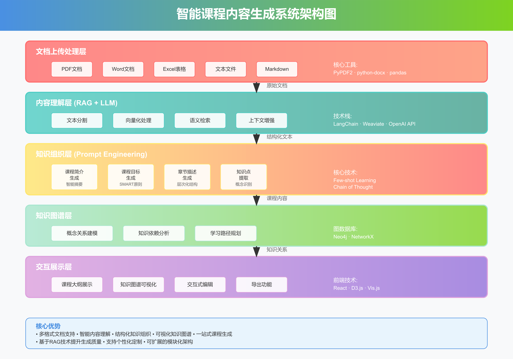
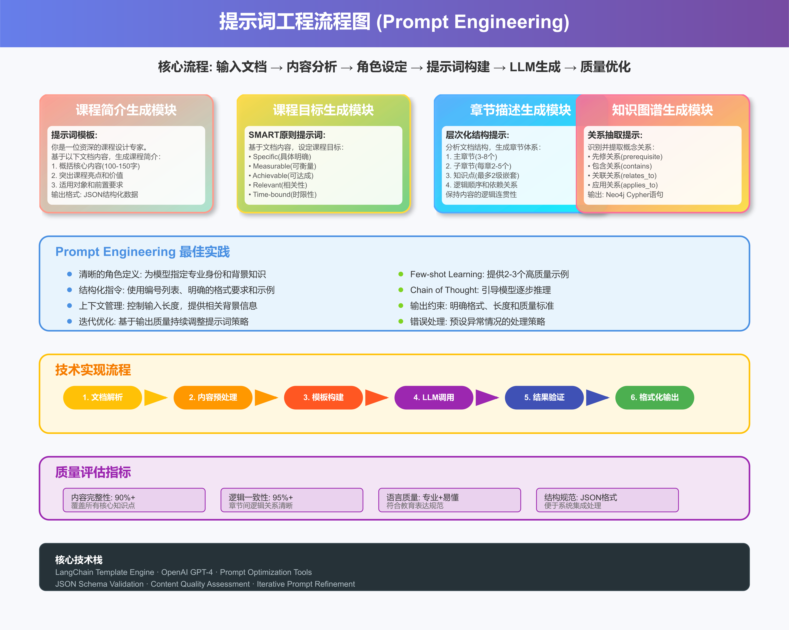
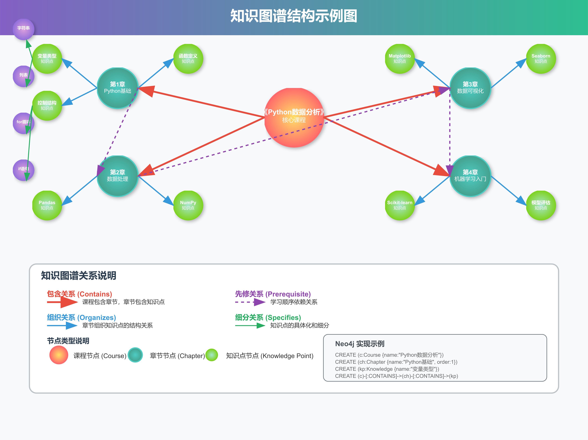
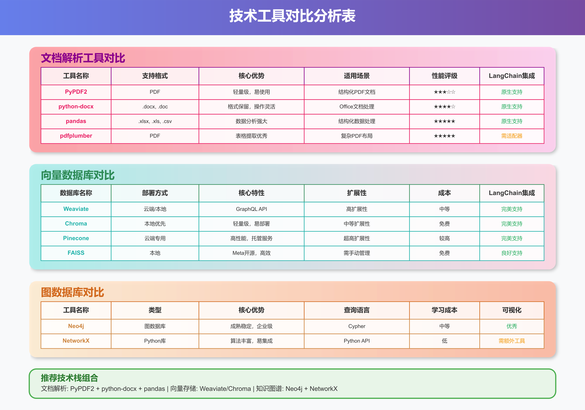

# 基于大模型实现智能课程内容生成系统：从文档到知识图谱的完整解决方案

> 在AI浪潮席卷教育行业的2025年，如何利用大模型技术自动生成高质量的课程内容？本文将深入探讨基于大模型的智能课程内容生成系统，涵盖从多格式文档处理到知识图谱构建的完整技术实现。

## 简述

随着教育数字化转型的深入推进，传统的课程开发模式面临着效率低下、内容更新滞后等挑战。2025年4月，教育部等九部门发布的《关于加快推进教育数字化的意见》明确提出要加快建设人工智能教育大模型，推动其与教育教学深度融合。本文将介绍一个完整的智能课程内容生成系统，该系统能够自动处理多种格式的文档（PDF、Word、Excel、文本、Markdown），并基于大模型技术生成结构化的课程内容，包括课程简介、学习目标、章节描述和知识图谱。通过RAG技术、LangChain框架和先进的提示词工程，系统实现了从文档理解到知识组织的全流程自动化，为教育工作者提供了一个高效、智能的课程开发工具。

---

## 1. 引言：智能教育的发展趋势

### 1.1 政策驱动下的教育AI化浪潮

2025年，中国在教育人工智能领域迎来了重要的政策转折点。教育部联合九部门发布的教育数字化指导意见，不仅强调了AI在教育领域的战略地位，更明确提出要探索开发思政教育、科学教育、美育、心理健康等垂直应用的专用大模型。

这一政策背景为智能课程内容生成系统的发展提供了强有力的支撑。北京市发布的《推进中小学人工智能教育工作方案（2025-2027年）》等地方政策，进一步推动了AI教育工具的实际应用。

### 1.2 传统课程开发面临的挑战

传统的课程开发模式存在诸多痛点：
- **效率低下**：从内容收集到课程大纲制作，往往需要数周甚至数月时间
- **质量不一**：依赖个人经验和能力，难以保证课程内容的标准化
- **更新滞后**：面对快速变化的知识体系，课程内容更新跟不上节奏
- **资源浪费**：重复性工作占用大量人力资源

### 1.3 大模型技术带来的机遇

大模型技术的成熟为解决这些问题提供了新的可能：
- **强大的内容理解能力**：能够准确解析各种格式的文档内容
- **结构化知识组织**：自动提取关键概念并建立逻辑关系
- **个性化内容生成**：基于不同需求生成定制化的课程内容
- **高效的质量保证**：通过标准化的提示词工程确保输出质量

## 2. 系统架构设计

智能课程内容生成系统采用分层架构设计，从底层的文档处理到顶层的内容展示，形成了一个完整的技术闭环。



### 2.1 架构层次分析

**文档上传处理层**是系统的数据入口，负责接收和预处理各种格式的文档。支持PDF、Word、Excel、文本和Markdown等主流格式，确保系统能够处理教育工作者日常使用的各种文档类型。

**内容理解层**是系统的核心，采用RAG（检索增强生成）技术，结合大模型的强大理解能力，对文档内容进行深度分析和语义理解。

**知识组织层**通过精心设计的提示词工程，将理解的内容转化为结构化的课程组件，包括课程简介、学习目标、章节描述等。

**知识图谱层**负责构建概念间的关系网络，为学习路径规划和知识依赖分析提供支撑。

**交互展示层**为用户提供友好的界面，支持课程内容的可视化展示和交互式编辑。

### 2.2 技术栈选择

系统的技术栈经过精心选择和优化：
- **后端框架**：Python + FastAPI，提供高性能的API服务
- **文档处理**：PyPDF2、python-docx、pandas等专业库
- **大模型接入**：OpenAI API或其他大模型服务
- **向量数据库**：Weaviate或Chroma，支持高效的语义检索
- **图数据库**：Neo4j，用于构建和查询知识图谱
- **前端技术**：React + D3.js，提供丰富的可视化功能

## 3. 各功能模块的详细实现

### 3.1 文档解析模块

文档解析是整个系统的基础，直接影响后续处理的质量和效果。

#### 3.1.1 PDF文档处理

```python
import PyPDF2
from langchain.document_loaders import PyPDFLoader
from langchain.text_splitter import RecursiveCharacterTextSplitter

def extract_pdf_content(pdf_path):
    """使用PyPDF2和LangChain处理PDF文档"""
    try:
        # 使用LangChain的PyPDFLoader
        loader = PyPDFLoader(pdf_path)
        documents = loader.load()
        
        # 文本分割
        text_splitter = RecursiveCharacterTextSplitter(
            chunk_size=1000,
            chunk_overlap=200,
            length_function=len
        )
        
        # 分割文档
        split_docs = text_splitter.split_documents(documents)
        
        return {
            'success': True,
            'content': split_docs,
            'metadata': {
                'total_pages': len(documents),
                'total_chunks': len(split_docs)
            }
        }
    except Exception as e:
        return {
            'success': False,
            'error': str(e),
            'content': []
        }
```

#### 3.1.2 Word文档处理

```python
from langchain.document_loaders import UnstructuredWordDocumentLoader
import docx

def extract_word_content(word_path):
    """处理Word文档，支持.doc和.docx格式"""
    try:
        # 使用LangChain的Unstructured loader
        loader = UnstructuredWordDocumentLoader(word_path)
        documents = loader.load()
        
        # 使用python-docx提取更详细的结构信息
        doc = docx.Document(word_path)
        structure_info = []
        
        for paragraph in doc.paragraphs:
            if paragraph.style.name.startswith('Heading'):
                structure_info.append({
                    'type': 'heading',
                    'level': int(paragraph.style.name.split(' ')[-1]),
                    'text': paragraph.text
                })
            else:
                structure_info.append({
                    'type': 'paragraph',
                    'text': paragraph.text
                })
        
        return {
            'success': True,
            'content': documents[0].page_content,
            'structure': structure_info,
            'metadata': {
                'paragraphs': len(doc.paragraphs),
                'tables': len(doc.tables)
            }
        }
    except Exception as e:
        return {
            'success': False,
            'error': str(e),
            'content': ''
        }
```

#### 3.1.3 Excel表格处理

```python
import pandas as pd
from langchain.schema import Document

def extract_excel_content(excel_path):
    """处理Excel文件，转换为结构化文本"""
    try:
        # 读取Excel文件的所有工作表
        excel_file = pd.ExcelFile(excel_path)
        sheets_content = []
        
        for sheet_name in excel_file.sheet_names:
            df = pd.read_excel(excel_path, sheet_name=sheet_name)
            
            # 将DataFrame转换为描述性文本
            sheet_text = f"工作表: {sheet_name}\n"
            sheet_text += f"数据行数: {len(df)}, 列数: {len(df.columns)}\n"
            sheet_text += f"列名: {', '.join(df.columns.tolist())}\n"
            
            # 转换前几行数据为文本描述
            if not df.empty:
                sheet_text += "数据示例:\n"
                sheet_text += df.head(5).to_string(index=False)
            
            sheets_content.append({
                'sheet_name': sheet_name,
                'content': sheet_text,
                'dataframe': df
            })
        
        # 合并所有工作表内容
        combined_content = "\n\n".join([sheet['content'] for sheet in sheets_content])
        
        return {
            'success': True,
            'content': combined_content,
            'sheets': sheets_content,
            'metadata': {
                'sheet_count': len(sheets_content),
                'total_rows': sum(len(sheet['dataframe']) for sheet in sheets_content)
            }
        }
    except Exception as e:
        return {
            'success': False,
            'error': str(e),
            'content': ''
        }
```

### 3.2 课程简介生成

课程简介是学习者了解课程的第一窗口，需要准确概括课程核心内容并突出价值。

#### 3.2.1 提示词设计

```python
def generate_course_introduction_prompt(document_content, course_type="通用"):
    """生成课程简介的提示词"""
    prompt = f"""
你是一位拥有20年教学经验的资深课程设计专家，擅长将复杂的专业内容转化为清晰易懂的课程描述。

任务：基于以下文档内容，生成一个优质的课程简介。

文档内容：
{document_content[:3000]}  # 限制输入长度

课程类型：{course_type}

请按照以下要求生成课程简介：

1. **内容概括**（100-150字）：
   - 准确概括课程的核心内容和主题
   - 突出课程的独特性和价值主张
   - 使用专业但易懂的语言

2. **适用对象**：
   - 明确目标学员群体
   - 说明适合的专业背景或基础要求
   - 提及学习难度水平

3. **学习收益**：
   - 列出3-5个具体的学习成果
   - 强调实用性和应用价值
   - 连接理论与实践

4. **课程亮点**：
   - 突出课程的特色和创新点
   - 提及实战案例或项目
   - 说明与行业需求的匹配度

输出格式要求：
```json
{{
    "title": "课程标题",
    "brief_description": "课程简介主体内容",
    "target_audience": "目标学员",
    "prerequisites": "前置要求",
    "learning_outcomes": [
        "学习成果1",
        "学习成果2",
        "学习成果3"
    ],
    "course_highlights": [
        "亮点1",
        "亮点2",
        "亮点3"
    ],
    "difficulty_level": "初级/中级/高级",
    "estimated_duration": "预计学时"
}}
```

注意事项：
- 确保内容准确，不添加文档中没有的信息
- 语言要专业而亲和，避免过度营销化
- 结构清晰，逻辑完整
- 突出实用价值和学习效果
"""
    return prompt
```

#### 3.2.2 LangChain实现

```python
from langchain.llms import OpenAI
from langchain.chains import LLMChain
from langchain.prompts import PromptTemplate
import json

class CourseIntroductionGenerator:
    def __init__(self, openai_api_key):
        self.llm = OpenAI(
            temperature=0.7,
            max_tokens=2000,
            openai_api_key=openai_api_key
        )
        
    def generate(self, document_content, course_type="通用"):
        """生成课程简介"""
        try:
            # 构建提示词
            prompt_text = generate_course_introduction_prompt(document_content, course_type)
            
            # 创建PromptTemplate
            prompt = PromptTemplate(
                input_variables=["content", "type"],
                template=prompt_text
            )
            
            # 创建链
            chain = LLMChain(llm=self.llm, prompt=prompt)
            
            # 执行生成
            result = chain.run(content=document_content, type=course_type)
            
            # 解析JSON结果
            try:
                parsed_result = json.loads(result)
                return {
                    'success': True,
                    'data': parsed_result
                }
            except json.JSONDecodeError:
                # 如果JSON解析失败，返回原始文本
                return {
                    'success': False,
                    'raw_content': result,
                    'error': 'JSON格式解析失败'
                }
                
        except Exception as e:
            return {
                'success': False,
                'error': str(e)
            }
            
    def validate_output(self, generated_content):
        """验证生成内容的质量"""
        required_fields = ['title', 'brief_description', 'target_audience', 'learning_outcomes']
        
        if not isinstance(generated_content, dict):
            return False, "输出格式不正确"
            
        missing_fields = [field for field in required_fields if field not in generated_content]
        if missing_fields:
            return False, f"缺少必要字段: {', '.join(missing_fields)}"
            
        # 检查内容长度
        if len(generated_content.get('brief_description', '')) < 100:
            return False, "课程简介过短"
            
        return True, "验证通过"
```

### 3.3 课程目标生成

课程目标的设定需要遵循SMART原则，确保目标具体、可衡量、可达成、相关性强且有时限。



#### 3.3.1 SMART原则提示词设计

```python
def generate_learning_objectives_prompt(document_content, course_level="中级"):
    """基于SMART原则生成学习目标的提示词"""
    prompt = f"""
你是一位教学设计专家，精通基于SMART原则的学习目标制定。请基于以下文档内容，为课程制定清晰的学习目标。

文档内容：
{document_content[:2500]}

课程水平：{course_level}

SMART原则要求：
- Specific（具体明确）：目标必须具体、明确，避免模糊表述
- Measurable（可衡量）：目标需要有明确的评价标准和衡量方式
- Achievable（可达成）：目标应当现实可行，符合学员能力水平
- Relevant（相关性）：目标与课程内容和实际需求紧密相关
- Time-bound（时限性）：目标应有明确的完成时间框架

请生成以下层次的学习目标：

1. **总体目标**（1-2个）：
   - 概括性描述学员完成课程后的整体能力
   - 体现课程的核心价值和最终成果

2. **知识目标**（3-4个）：
   - 学员需要理解和掌握的理论知识
   - 使用"理解"、"掌握"、"分析"等认知动词

3. **技能目标**（3-5个）：
   - 学员需要获得的具体操作技能
   - 使用"能够"、"会使用"、"可以完成"等表述

4. **应用目标**（2-3个）：
   - 学员在实际工作中的应用能力
   - 强调解决实际问题的能力

输出格式：
```json
{{
    "overall_objectives": [
        "总体目标1",
        "总体目标2"
    ],
    "knowledge_objectives": [
        {{
            "objective": "知识目标描述",
            "assessment_method": "评价方式",
            "bloom_level": "布鲁姆认知层次"
        }}
    ],
    "skill_objectives": [
        {{
            "objective": "技能目标描述",
            "assessment_method": "评价方式",
            "proficiency_level": "熟练程度要求"
        }}
    ],
    "application_objectives": [
        {{
            "objective": "应用目标描述",
            "real_world_context": "应用场景",
            "success_criteria": "成功标准"
        }}
    ],
    "learning_timeline": "建议学习时长",
    "prerequisites": "前置知识要求"
}}
```

请确保：
- 每个目标都包含具体的行为动词
- 避免使用"了解"、"知道"等模糊词汇
- 目标之间有层次性和递进关系
- 符合课程内容的实际情况
"""
    return prompt
```

#### 3.3.2 目标质量验证

```python
class LearningObjectivesValidator:
    """学习目标质量验证器"""
    
    SMART_CRITERIA = {
        'specific': ['具体', '明确', '详细'],
        'measurable': ['能够', '会', '可以', '掌握'],
        'achievable': ['基础', '初步', '熟练'],
        'relevant': ['应用', '工作', '实践'],
        'timebound': ['课程结束后', '学习期间', '完成时']
    }
    
    BLOOM_LEVELS = {
        '记忆': ['记住', '识别', '列举'],
        '理解': ['理解', '解释', '描述'],
        '应用': ['应用', '使用', '执行'],
        '分析': ['分析', '比较', '区分'],
        '评价': ['评价', '判断', '选择'],
        '创造': ['创造', '设计', '开发']
    }
    
    def validate_objectives(self, objectives_data):
        """验证学习目标的质量"""
        validation_results = {
            'overall_score': 0,
            'detailed_feedback': [],
            'suggestions': []
        }
        
        # 验证总体目标
        if 'overall_objectives' in objectives_data:
            overall_score = self._validate_overall_objectives(
                objectives_data['overall_objectives']
            )
            validation_results['overall_score'] += overall_score * 0.3
        
        # 验证知识目标
        if 'knowledge_objectives' in objectives_data:
            knowledge_score = self._validate_knowledge_objectives(
                objectives_data['knowledge_objectives']
            )
            validation_results['overall_score'] += knowledge_score * 0.25
        
        # 验证技能目标
        if 'skill_objectives' in objectives_data:
            skill_score = self._validate_skill_objectives(
                objectives_data['skill_objectives']
            )
            validation_results['overall_score'] += skill_score * 0.25
        
        # 验证应用目标
        if 'application_objectives' in objectives_data:
            application_score = self._validate_application_objectives(
                objectives_data['application_objectives']
            )
            validation_results['overall_score'] += application_score * 0.2
        
        # 生成改进建议
        if validation_results['overall_score'] < 0.8:
            validation_results['suggestions'] = self._generate_suggestions(objectives_data)
        
        return validation_results
    
    def _validate_overall_objectives(self, objectives):
        """验证总体目标"""
        score = 0
        if len(objectives) > 0 and len(objectives) <= 2:
            score += 0.3
        
        for obj in objectives:
            if len(obj.split()) >= 10:  # 目标描述足够详细
                score += 0.3
            if any(word in obj for word in ['能够', '完成', '掌握']):
                score += 0.4
                
        return min(score, 1.0)
    
    def _check_smart_compliance(self, objective_text):
        """检查目标是否符合SMART原则"""
        smart_score = 0
        
        for criteria, keywords in self.SMART_CRITERIA.items():
            if any(keyword in objective_text for keyword in keywords):
                smart_score += 0.2
                
        return smart_score
```

### 3.4 章节及描述生成

章节结构的生成需要保证逻辑清晰、层次分明，知识点之间有合理的递进关系。

#### 3.4.1 章节结构分析提示词

```python
def generate_chapter_structure_prompt(document_content, max_chapters=8):
    """生成章节结构的提示词"""
    prompt = f"""
你是一位资深的课程架构师，擅长将复杂内容组织成清晰的章节结构。请基于以下文档内容，设计一个逻辑清晰的课程章节体系。

文档内容：
{document_content[:4000]}

设计要求：
1. **章节数量**：主章节3-{max_chapters}个，避免过多或过少
2. **层次结构**：
   - 主章节（Chapter）
   - 子章节（Section，每章2-5个）
   - 知识点（Knowledge Point，最多2级嵌套）
3. **逻辑顺序**：遵循学习规律，从基础到进阶
4. **内容均衡**：各章节内容量相对均衡

章节命名规范：
- 主章节：简洁明了，体现核心主题
- 子章节：具体描述，便于理解
- 知识点：精准表达，避免重复

请分析文档结构，识别以下要素：
- 核心概念和理论
- 技术方法和工具
- 实践应用和案例
- 前置关系和依赖

输出格式：
```json
{{
    "course_structure": {{
        "total_chapters": 6,
        "estimated_hours": 24,
        "difficulty_progression": "递进式",
        "chapters": [
            {{
                "chapter_id": 1,
                "chapter_title": "第1章 章节标题",
                "chapter_description": "章节描述，说明本章的主要内容和学习目标",
                "estimated_hours": 4,
                "difficulty_level": "基础/中级/高级",
                "learning_objectives": [
                    "学习目标1",
                    "学习目标2"
                ],
                "sections": [
                    {{
                        "section_id": "1.1",
                        "section_title": "子章节标题",
                        "section_description": "子章节描述",
                        "estimated_minutes": 45,
                        "knowledge_points": [
                            {{
                                "point_id": "1.1.1",
                                "point_title": "知识点标题",
                                "point_description": "知识点详细描述",
                                "point_type": "概念/方法/工具/案例",
                                "prerequisites": ["前置知识点ID"],
                                "sub_points": [
                                    {{
                                        "sub_point_id": "1.1.1.1",
                                        "sub_point_title": "子知识点标题",
                                        "sub_point_description": "子知识点描述"
                                    }}
                                ]
                            }}
                        ]
                    }}
                ]
            }}
        ]
    }},
    "knowledge_dependencies": [
        {{
            "from": "知识点ID",
            "to": "依赖的知识点ID",
            "relationship_type": "prerequisite/builds_on/relates_to"
        }}
    ],
    "learning_path_suggestions": [
        "学习路径建议1",
        "学习路径建议2"
    ]
}}
```

特别注意：
- 确保章节间有明确的逻辑关系
- 知识点不要过于细碎或过于宽泛
- 考虑不同学习者的需求
- 保持整体结构的平衡性
"""
    return prompt
```

#### 3.4.2 章节内容生成器

```python
from langchain.chains import LLMChain
from langchain.prompts import PromptTemplate

class ChapterContentGenerator:
    """章节内容生成器"""
    
    def __init__(self, llm):
        self.llm = llm
        
    def generate_chapter_content(self, chapter_info, source_content):
        """为特定章节生成详细内容"""
        
        prompt_template = """
基于以下章节信息和源文档内容，生成该章节的详细教学内容。

章节信息：
标题：{chapter_title}
描述：{chapter_description}
学习目标：{learning_objectives}

源文档内容（相关部分）：
{source_content}

请生成以下内容：

1. **章节导入**：
   - 引人入胜的开场白
   - 与前面章节的联系
   - 本章节的学习重点

2. **核心内容**：
   - 理论知识的系统阐述
   - 概念的清晰定义
   - 原理的深入解释

3. **实践应用**：
   - 具体的应用场景
   - 实际操作步骤
   - 注意事项和技巧

4. **案例分析**：
   - 典型案例介绍
   - 解决方案分析
   - 成功经验总结

5. **章节小结**：
   - 重点内容回顾
   - 知识点串联
   - 与下章的过渡

输出要求：
- 内容详实，逻辑清晰
- 语言专业但易懂
- 结构完整，层次分明
- 理论与实践相结合
"""
        
        prompt = PromptTemplate(
            input_variables=["chapter_title", "chapter_description", "learning_objectives", "source_content"],
            template=prompt_template
        )
        
        chain = LLMChain(llm=self.llm, prompt=prompt)
        
        # 准备输入数据
        objectives_text = "\n".join(chapter_info.get('learning_objectives', []))
        
        try:
            result = chain.run(
                chapter_title=chapter_info['chapter_title'],
                chapter_description=chapter_info['chapter_description'],
                learning_objectives=objectives_text,
                source_content=source_content[:3000]  # 控制输入长度
            )
            
            return {
                'success': True,
                'content': result,
                'chapter_id': chapter_info['chapter_id']
            }
        except Exception as e:
            return {
                'success': False,
                'error': str(e),
                'chapter_id': chapter_info['chapter_id']
            }
    
    def generate_all_chapters(self, course_structure, source_documents):
        """生成所有章节的内容"""
        generated_chapters = []
        
        for chapter in course_structure['chapters']:
            # 为每个章节匹配相关的源文档内容
            relevant_content = self._match_relevant_content(chapter, source_documents)
            
            # 生成章节内容
            chapter_result = self.generate_chapter_content(chapter, relevant_content)
            generated_chapters.append(chapter_result)
        
        return generated_chapters
    
    def _match_relevant_content(self, chapter_info, source_documents):
        """为章节匹配相关的源文档内容"""
        # 这里可以实现更复杂的匹配逻辑，比如使用向量相似度
        # 简化实现：基于关键词匹配
        
        chapter_keywords = self._extract_keywords_from_chapter(chapter_info)
        relevant_content = []
        
        for doc in source_documents:
            doc_text = doc.page_content if hasattr(doc, 'page_content') else str(doc)
            
            # 计算匹配度
            match_score = self._calculate_match_score(chapter_keywords, doc_text)
            
            if match_score > 0.3:  # 设置匹配阈值
                relevant_content.append(doc_text)
        
        return "\n\n".join(relevant_content[:3])  # 最多使用3个最相关的文档
    
    def _extract_keywords_from_chapter(self, chapter_info):
        """从章节信息中提取关键词"""
        keywords = []
        
        # 从标题提取
        title_words = chapter_info['chapter_title'].split()
        keywords.extend(title_words)
        
        # 从描述提取（简化实现）
        desc_words = chapter_info['chapter_description'].split()
        keywords.extend(desc_words)
        
        # 去重并返回
        return list(set(keywords))
    
    def _calculate_match_score(self, keywords, text):
        """计算关键词与文本的匹配度"""
        if not keywords or not text:
            return 0
        
        text_lower = text.lower()
        matches = sum(1 for keyword in keywords if keyword.lower() in text_lower)
        
        return matches / len(keywords)
```

### 3.5 知识图谱构建

知识图谱是智能课程系统的高级功能，能够展现知识点之间的复杂关系，为个性化学习路径规划提供支撑。



#### 3.5.1 知识实体识别与关系抽取

```python
import spacy
from langchain.schema import BaseOutputParser
import json

class KnowledgeEntityExtractor:
    """知识实体提取器"""
    
    def __init__(self):
        # 加载中文语言模型
        try:
            self.nlp = spacy.load("zh_core_web_sm")
        except OSError:
            print("请先安装中文语言模型: python -m spacy download zh_core_web_sm")
            self.nlp = None
    
    def extract_entities_and_relations(self, course_content):
        """从课程内容中提取知识实体和关系"""
        if not self.nlp:
            return self._fallback_extraction(course_content)
        
        entities = []
        relations = []
        
        # 处理文档
        doc = self.nlp(course_content)
        
        # 提取实体
        for ent in doc.ents:
            if ent.label_ in ['ORG', 'PERSON', 'GPE', 'PRODUCT']:  # 相关实体类型
                entities.append({
                    'text': ent.text,
                    'label': ent.label_,
                    'start': ent.start_char,
                    'end': ent.end_char
                })
        
        # 提取关系（基于依存分析）
        for token in doc:
            if token.dep_ in ['nsubj', 'dobj', 'prep']:  # 相关依存关系
                relations.append({
                    'head': token.head.text,
                    'relation': token.dep_,
                    'tail': token.text
                })
        
        return {
            'entities': entities,
            'relations': relations
        }
    
    def _fallback_extraction(self, content):
        """备用提取方法，基于规则"""
        # 简化的基于规则的提取
        import re
        
        # 提取可能的概念（大写开头的词组）
        concept_pattern = r'[A-Z][a-zA-Z\s]{2,20}'
        concepts = re.findall(concept_pattern, content)
        
        # 提取可能的关系词
        relation_keywords = ['包含', '属于', '依赖', '实现', '应用', '基于']
        relations = []
        
        for keyword in relation_keywords:
            if keyword in content:
                # 简化的关系抽取
                sentences = content.split('。')
                for sentence in sentences:
                    if keyword in sentence:
                        relations.append({
                            'sentence': sentence.strip(),
                            'relation_type': keyword
                        })
        
        return {
            'concepts': concepts,
            'relations': relations
        }

class KnowledgeGraphBuilder:
    """知识图谱构建器"""
    
    def __init__(self, neo4j_uri=None, username=None, password=None):
        self.neo4j_uri = neo4j_uri
        self.username = username
        self.password = password
        self.driver = None
        
        if all([neo4j_uri, username, password]):
            self._connect_neo4j()
    
    def _connect_neo4j(self):
        """连接Neo4j数据库"""
        try:
            from neo4j import GraphDatabase
            self.driver = GraphDatabase.driver(
                self.neo4j_uri,
                auth=(self.username, self.password)
            )
        except ImportError:
            print("请安装neo4j驱动: pip install neo4j")
        except Exception as e:
            print(f"Neo4j连接失败: {e}")
    
    def build_course_knowledge_graph(self, course_structure):
        """基于课程结构构建知识图谱"""
        graph_data = {
            'nodes': [],
            'edges': [],
            'cypher_statements': []
        }
        
        # 创建课程节点
        course_node = {
            'id': 'course_root',
            'type': 'Course',
            'name': course_structure.get('course_title', '未命名课程'),
            'properties': {
                'total_chapters': course_structure.get('total_chapters', 0),
                'estimated_hours': course_structure.get('estimated_hours', 0)
            }
        }
        graph_data['nodes'].append(course_node)
        
        # 创建课程节点的Cypher语句
        graph_data['cypher_statements'].append(
            f"CREATE (c:Course {{name: '{course_node['name']}', "
            f"total_chapters: {course_node['properties']['total_chapters']}, "
            f"estimated_hours: {course_node['properties']['estimated_hours']}}})"
        )
        
        # 处理每个章节
        for chapter in course_structure.get('chapters', []):
            chapter_node_id = f"chapter_{chapter['chapter_id']}"
            
            # 创建章节节点
            chapter_node = {
                'id': chapter_node_id,
                'type': 'Chapter',
                'name': chapter['chapter_title'],
                'properties': {
                    'description': chapter.get('chapter_description', ''),
                    'difficulty_level': chapter.get('difficulty_level', ''),
                    'estimated_hours': chapter.get('estimated_hours', 0)
                }
            }
            graph_data['nodes'].append(chapter_node)
            
            # 创建课程到章节的关系
            graph_data['edges'].append({
                'from': 'course_root',
                'to': chapter_node_id,
                'relationship': 'CONTAINS',
                'properties': {'order': chapter['chapter_id']}
            })
            
            # Cypher语句
            graph_data['cypher_statements'].append(
                f"CREATE (ch{chapter['chapter_id']}:Chapter {{"
                f"name: '{chapter['chapter_title']}', "
                f"description: '{chapter.get('chapter_description', '')}', "
                f"difficulty_level: '{chapter.get('difficulty_level', '')}'"
                f"}})"
            )
            
            graph_data['cypher_statements'].append(
                f"CREATE (c)-[:CONTAINS {{order: {chapter['chapter_id']}}}]->(ch{chapter['chapter_id']})"
            )
            
            # 处理章节中的知识点
            for section in chapter.get('sections', []):
                section_node_id = f"section_{section['section_id']}"
                
                # 创建小节节点
                section_node = {
                    'id': section_node_id,
                    'type': 'Section',
                    'name': section['section_title'],
                    'properties': {
                        'description': section.get('section_description', ''),
                        'estimated_minutes': section.get('estimated_minutes', 0)
                    }
                }
                graph_data['nodes'].append(section_node)
                
                # 创建章节到小节的关系
                graph_data['edges'].append({
                    'from': chapter_node_id,
                    'to': section_node_id,
                    'relationship': 'CONTAINS'
                })
                
                # 处理知识点
                for kp in section.get('knowledge_points', []):
                    kp_node_id = f"kp_{kp['point_id']}"
                    
                    # 创建知识点节点
                    kp_node = {
                        'id': kp_node_id,
                        'type': 'KnowledgePoint',
                        'name': kp['point_title'],
                        'properties': {
                            'description': kp.get('point_description', ''),
                            'point_type': kp.get('point_type', ''),
                        }
                    }
                    graph_data['nodes'].append(kp_node)
                    
                    # 创建小节到知识点的关系
                    graph_data['edges'].append({
                        'from': section_node_id,
                        'to': kp_node_id,
                        'relationship': 'CONTAINS'
                    })
                    
                    # 处理知识点的前置依赖
                    for prereq in kp.get('prerequisites', []):
                        prereq_id = f"kp_{prereq}"
                        graph_data['edges'].append({
                            'from': prereq_id,
                            'to': kp_node_id,
                            'relationship': 'PREREQUISITE'
                        })
        
        return graph_data
    
    def export_to_neo4j(self, graph_data):
        """将图数据导出到Neo4j"""
        if not self.driver:
            print("Neo4j未连接，无法导出")
            return False
        
        try:
            with self.driver.session() as session:
                # 清空现有数据（谨慎操作）
                session.run("MATCH (n) DETACH DELETE n")
                
                # 执行Cypher语句
                for statement in graph_data['cypher_statements']:
                    session.run(statement)
                
                print("知识图谱已成功导出到Neo4j")
                return True
        except Exception as e:
            print(f"Neo4j导出失败: {e}")
            return False
    
    def generate_networkx_graph(self, graph_data):
        """生成NetworkX图对象，用于分析和可视化"""
        try:
            import networkx as nx
            
            G = nx.DiGraph()  # 有向图
            
            # 添加节点
            for node in graph_data['nodes']:
                G.add_node(
                    node['id'],
                    name=node['name'],
                    type=node['type'],
                    **node.get('properties', {})
                )
            
            # 添加边
            for edge in graph_data['edges']:
                G.add_edge(
                    edge['from'],
                    edge['to'],
                    relationship=edge['relationship'],
                    **edge.get('properties', {})
                )
            
            return G
        except ImportError:
            print("请安装networkx: pip install networkx")
            return None
    
    def analyze_graph_structure(self, G):
        """分析图结构，提供学习路径建议"""
        if not G:
            return {}
        
        try:
            import networkx as nx
            
            analysis = {
                'basic_stats': {
                    'total_nodes': G.number_of_nodes(),
                    'total_edges': G.number_of_edges(),
                    'is_connected': nx.is_weakly_connected(G)
                },
                'centrality_analysis': {
                    'degree_centrality': nx.degree_centrality(G),
                    'betweenness_centrality': nx.betweenness_centrality(G)
                },
                'learning_paths': []
            }
            
            # 寻找学习路径（从课程根节点开始的拓扑排序）
            try:
                if nx.is_directed_acyclic_graph(G):
                    topo_order = list(nx.topological_sort(G))
                    analysis['learning_paths'] = [topo_order]
                else:
                    # 如果存在环，尝试找到主要路径
                    course_nodes = [n for n in G.nodes() if G.nodes[n].get('type') == 'Course']
                    if course_nodes:
                        paths = nx.single_source_shortest_path(G, course_nodes[0])
                        analysis['learning_paths'] = list(paths.values())
            except:
                pass
            
            return analysis
        except Exception as e:
            print(f"图结构分析失败: {e}")
            return {}
```

#### 3.5.2 知识图谱可视化

```python
def generate_graph_visualization_code(graph_data):
    """生成知识图谱的前端可视化代码"""
    
    # 准备vis.js格式的数据
    vis_nodes = []
    vis_edges = []
    
    # 节点样式配置
    node_styles = {
        'Course': {'color': '#FF6B6B', 'size': 50, 'font': {'size': 16}},
        'Chapter': {'color': '#4ECDC4', 'size': 35, 'font': {'size': 14}},
        'Section': {'color': '#45B7D1', 'size': 25, 'font': {'size': 12}},
        'KnowledgePoint': {'color': '#7ED321', 'size': 20, 'font': {'size': 10}}
    }
    
    # 转换节点
    for node in graph_data['nodes']:
        style = node_styles.get(node['type'], node_styles['KnowledgePoint'])
        vis_nodes.append({
            'id': node['id'],
            'label': node['name'][:20],  # 限制标签长度
            'title': node['name'],  # 悬浮提示
            'group': node['type'],
            **style
        })
    
    # 转换边
    for edge in graph_data['edges']:
        edge_style = {
            'CONTAINS': {'color': '#E74C3C', 'width': 3, 'arrows': 'to'},
            'PREREQUISITE': {'color': '#8E44AD', 'width': 2, 'arrows': 'to', 'dashes': True},
            'RELATES_TO': {'color': '#27AE60', 'width': 1, 'arrows': 'to'}
        }
        
        style = edge_style.get(edge['relationship'], edge_style['RELATES_TO'])
        vis_edges.append({
            'from': edge['from'],
            'to': edge['to'],
            'label': edge['relationship'],
            **style
        })
    
    # 生成HTML可视化代码
    html_code = f"""
<!DOCTYPE html>
<html>
<head>
    <title>课程知识图谱</title>
    <script type="text/javascript" src="https://unpkg.com/vis-network/standalone/umd/vis-network.min.js"></script>
    <style type="text/css">
        #mynetworkid {{
            width: 1200px;
            height: 800px;
            border: 1px solid lightgray;
        }}
        .info-panel {{
            position: absolute;
            top: 10px;
            right: 10px;
            width: 300px;
            background: white;
            border: 1px solid #ccc;
            padding: 10px;
            border-radius: 5px;
        }}
    </style>
</head>
<body>
    <h2>智能课程内容生成系统 - 知识图谱</h2>
    
    <div id="mynetworkid"></div>
    <div class="info-panel" id="info-panel">
        <h4>图谱信息</h4>
        <p>节点总数: {len(vis_nodes)}</p>
        <p>关系总数: {len(vis_edges)}</p>
        <div id="node-info"></div>
    </div>

    <script type="text/javascript">
        var nodes = new vis.DataSet({json.dumps(vis_nodes, ensure_ascii=False, indent=2)});
        var edges = new vis.DataSet({json.dumps(vis_edges, ensure_ascii=False, indent=2)});
        var container = document.getElementById('mynetworkid');
        var data = {{
            nodes: nodes,
            edges: edges
        }};
        var options = {{
            layout: {{
                hierarchical: {{
                    direction: 'UD',
                    sortMethod: 'directed',
                    levelSeparation: 100
                }}
            }},
            physics: {{
                hierarchicalRepulsion: {{
                    centralGravity: 0.0,
                    springLength: 100,
                    springConstant: 0.01,
                    nodeDistance: 120,
                    damping: 0.09
                }},
                maxVelocity: 50,
                solver: 'hierarchicalRepulsion',
                timestep: 0.35,
                stabilization: {{iterations: 150}}
            }},
            nodes: {{
                shape: 'dot',
                font: {{
                    size: 12,
                    color: '#000000'
                }},
                borderWidth: 2
            }},
            edges: {{
                font: {{
                    size: 10,
                    align: 'middle'
                }},
                smooth: {{
                    type: 'continuous'
                }}
            }},
            interaction: {{
                dragNodes: true,
                dragView: true,
                zoomView: true
            }}
        }};
        
        var network = new vis.Network(container, data, options);
        
        // 添加点击事件
        network.on("click", function (params) {{
            var nodeId = params.nodes[0];
            if (nodeId) {{
                var node = nodes.get(nodeId);
                document.getElementById('node-info').innerHTML = 
                    '<h5>' + node.title + '</h5>' +
                    '<p>类型: ' + node.group + '</p>' +
                    '<p>ID: ' + node.id + '</p>';
            }}
        }});
    </script>
</body>
</html>
"""
    
    return html_code
```

## 4. 实战案例演示

为了更好地展示系统的实际应用效果，我们以一个具体的Python数据分析课程为例，演示整个生成流程。

### 4.1 输入文档示例

假设我们有以下输入文档：

**文档名称**: `Python数据分析教程.pdf`
**文档内容概要**: 包含Python基础语法、NumPy数组操作、Pandas数据处理、Matplotlib可视化、以及机器学习入门等内容。

### 4.2 系统处理流程演示

#### 4.2.1 文档解析结果

```python
# 文档解析输出示例
document_parsing_result = {
    "success": True,
    "document_type": "PDF",
    "total_pages": 156,
    "total_chunks": 87,
    "content_structure": {
        "chapters_detected": 6,
        "main_topics": [
            "Python基础语法",
            "NumPy数组计算",
            "Pandas数据处理",
            "数据可视化",
            "统计分析",
            "机器学习入门"
        ]
    },
    "metadata": {
        "estimated_reading_time": "8小时",
        "difficulty_level": "中级",
        "target_audience": "数据分析初学者"
    }
}
```

#### 4.2.2 课程简介生成结果

```json
{
    "title": "Python数据分析实战课程",
    "brief_description": "本课程是一门面向数据分析初学者的实战性课程，系统性地介绍了Python在数据分析领域的核心技术和实际应用。课程从Python基础语法开始，深入讲解NumPy数组计算、Pandas数据处理、Matplotlib数据可视化等关键技术，并通过丰富的实战案例帮助学员掌握数据清洗、探索性数据分析、统计建模等核心技能，最终能够独立完成完整的数据分析项目。",
    "target_audience": "具备基本编程概念的数据分析初学者、希望转型数据分析的开发者、需要数据处理能力的业务人员",
    "prerequisites": "了解基本的编程概念，有简单的Python语法基础更佳",
    "learning_outcomes": [
        "掌握Python数据分析核心库的使用方法",
        "能够独立完成数据清洗和预处理工作",
        "具备探索性数据分析和可视化能力",
        "了解基本的机器学习算法和应用场景",
        "能够设计并执行完整的数据分析项目"
    ],
    "course_highlights": [
        "理论与实践紧密结合，每个概念都有对应案例",
        "涵盖完整数据分析工作流程",
        "提供真实业务数据集进行实战练习",
        "配套Jupyter Notebook交互式学习环境"
    ],
    "difficulty_level": "中级",
    "estimated_duration": "40学时"
}
```

#### 4.2.3 课程目标生成结果

```json
{
    "overall_objectives": [
        "学员将能够使用Python及其数据分析生态系统完成从数据获取到结果呈现的完整数据分析项目",
        "培养数据思维，能够从业务问题出发设计分析方案并得出有价值的结论"
    ],
    "knowledge_objectives": [
        {
            "objective": "理解并掌握NumPy数组的创建、索引、切片和广播机制",
            "assessment_method": "编程练习和理论测试",
            "bloom_level": "应用"
        },
        {
            "objective": "熟练掌握Pandas中DataFrame和Series的数据操作方法",
            "assessment_method": "实际数据处理任务",
            "bloom_level": "应用"
        },
        {
            "objective": "理解数据可视化的原则和Matplotlib的绘图体系",
            "assessment_method": "可视化作品展示",
            "bloom_level": "分析"
        }
    ],
    "skill_objectives": [
        {
            "objective": "能够熟练使用pandas进行数据清洗，处理缺失值、重复值和异常值",
            "assessment_method": "实际数据清洗项目",
            "proficiency_level": "熟练"
        },
        {
            "objective": "会使用matplotlib和seaborn创建各种类型的统计图表",
            "assessment_method": "可视化项目作品",
            "proficiency_level": "熟练"
        },
        {
            "objective": "能够运用描述性统计和基本推断统计方法分析数据",
            "assessment_method": "统计分析报告",
            "proficiency_level": "基础"
        }
    ],
    "application_objectives": [
        {
            "objective": "能够独立完成端到端的数据分析项目，从问题定义到结论呈现",
            "real_world_context": "业务数据分析场景",
            "success_criteria": "提交完整的分析报告和可重现的代码"
        },
        {
            "objective": "能够根据业务需求选择合适的分析方法和可视化形式",
            "real_world_context": "企业决策支持",
            "success_criteria": "分析结果能够支撑业务决策"
        }
    ],
    "learning_timeline": "10-12周，每周3-4学时",
    "prerequisites": "Python基础语法、基本统计概念"
}
```

#### 4.2.4 章节结构生成结果



```json
{
    "course_structure": {
        "total_chapters": 6,
        "estimated_hours": 40,
        "difficulty_progression": "递进式",
        "chapters": [
            {
                "chapter_id": 1,
                "chapter_title": "第1章 Python数据分析环境搭建与基础回顾",
                "chapter_description": "建立完整的Python数据分析开发环境，回顾必要的Python语法基础，介绍Jupyter Notebook的使用方法，为后续学习奠定基础。",
                "estimated_hours": 4,
                "difficulty_level": "基础",
                "learning_objectives": [
                    "掌握Anaconda环境的安装和配置",
                    "熟悉Jupyter Notebook的基本操作",
                    "复习Python核心数据类型和控制结构"
                ],
                "sections": [
                    {
                        "section_id": "1.1",
                        "section_title": "开发环境搭建",
                        "section_description": "安装配置Python数据分析开发环境",
                        "estimated_minutes": 60,
                        "knowledge_points": [
                            {
                                "point_id": "1.1.1",
                                "point_title": "Anaconda安装配置",
                                "point_description": "下载安装Anaconda，配置环境变量，管理Python包",
                                "point_type": "工具",
                                "prerequisites": [],
                                "sub_points": [
                                    {
                                        "sub_point_id": "1.1.1.1",
                                        "sub_point_title": "下载与安装",
                                        "sub_point_description": "从官网下载并安装Anaconda"
                                    },
                                    {
                                        "sub_point_id": "1.1.1.2", 
                                        "sub_point_title": "环境管理",
                                        "sub_point_description": "使用conda命令管理虚拟环境"
                                    }
                                ]
                            }
                        ]
                    },
                    {
                        "section_id": "1.2",
                        "section_title": "Python基础回顾",
                        "section_description": "回顾数据分析必需的Python语法基础",
                        "estimated_minutes": 90,
                        "knowledge_points": [
                            {
                                "point_id": "1.2.1",
                                "point_title": "数据类型与变量",
                                "point_description": "复习Python基本数据类型：数字、字符串、列表、字典等",
                                "point_type": "概念",
                                "prerequisites": []
                            },
                            {
                                "point_id": "1.2.2",
                                "point_title": "控制结构",
                                "point_description": "条件语句、循环语句在数据处理中的应用",
                                "point_type": "方法",
                                "prerequisites": ["1.2.1"]
                            }
                        ]
                    }
                ]
            },
            {
                "chapter_id": 2,
                "chapter_title": "第2章 NumPy数组计算基础",
                "chapter_description": "深入学习NumPy库，掌握多维数组的创建、操作和计算方法，理解向量化计算的优势，为后续数据处理打下坚实基础。",
                "estimated_hours": 8,
                "difficulty_level": "中级",
                "learning_objectives": [
                    "掌握NumPy数组的创建和基本属性",
                    "理解数组的索引、切片和形状操作",
                    "学会使用NumPy进行数学运算和统计计算"
                ],
                "sections": [
                    {
                        "section_id": "2.1",
                        "section_title": "NumPy数组基础",
                        "section_description": "学习NumPy数组的基本概念和创建方法",
                        "estimated_minutes": 120,
                        "knowledge_points": [
                            {
                                "point_id": "2.1.1",
                                "point_title": "ndarray对象",
                                "point_description": "理解NumPy核心数据结构ndarray的特性和优势",
                                "point_type": "概念",
                                "prerequisites": ["1.2.1"]
                            }
                        ]
                    }
                ]
            }
        ]
    },
    "knowledge_dependencies": [
        {
            "from": "1.1.1",
            "to": "1.2.1",
            "relationship_type": "prerequisite"
        },
        {
            "from": "1.2.1",
            "to": "2.1.1",
            "relationship_type": "prerequisite"
        }
    ],
    "learning_path_suggestions": [
        "建议按照章节顺序学习，确保基础扎实",
        "每章学习后完成配套练习，巩固知识点",
        "第3章开始涉及实际数据，建议准备真实数据集练习"
    ]
}
```

### 4.3 知识图谱生成展示

基于生成的课程结构，系统会自动构建知识图谱，展示概念间的复杂关系网络。知识图谱不仅包含了章节的包含关系，还标识了知识点之间的先修依赖关系。

## 5. 优化建议和最佳实践

### 5.1 提示词工程优化

#### 5.1.1 分层式提示词设计

```python
class PromptOptimizer:
    """提示词优化器"""
    
    def __init__(self):
        self.prompt_templates = {
            'system_role': {
                'expert': "你是一位拥有15年教学经验的资深课程设计专家",
                'analyst': "你是一位专业的教育内容分析师",
                'architect': "你是一位课程架构设计师"
            },
            'context_setup': {
                'academic': "在学术教育环境中",
                'professional': "在职业培训场景下", 
                'online': "在在线教育平台上"
            },
            'output_constraints': {
                'structured': "请严格按照JSON格式输出",
                'detailed': "请提供详细的分析和建议",
                'concise': "请保持内容简洁明了"
            }
        }
    
    def build_optimized_prompt(self, task_type, context, requirements):
        """构建优化的提示词"""
        
        # 选择合适的角色设定
        role = self.prompt_templates['system_role'].get(
            task_type, 
            self.prompt_templates['system_role']['expert']
        )
        
        # 设定上下文环境
        context_setup = self.prompt_templates['context_setup'].get(
            context,
            self.prompt_templates['context_setup']['academic']
        )
        
        # 构建完整提示词
        optimized_prompt = f"""
{role}，{context_setup}工作。

任务要求：
{requirements}

优化策略：
1. 使用具体的动作动词（如"分析"、"设计"、"构建"而非"了解"）
2. 提供明确的评价标准和成功指标
3. 包含错误处理和边界情况考虑
4. 结合实际应用场景和案例

请确保输出内容：
- 逻辑清晰，结构完整
- 符合教育学原理
- 考虑学习者的认知负荷
- 具备实际操作价值
"""
        
        return optimized_prompt
    
    def A_B_test_prompts(self, prompt_a, prompt_b, test_data, llm):
        """A/B测试不同提示词的效果"""
        results = {
            'prompt_a_results': [],
            'prompt_b_results': [],
            'comparison': {}
        }
        
        for data in test_data:
            # 测试提示词A
            result_a = llm.predict(prompt_a.format(data=data))
            results['prompt_a_results'].append(result_a)
            
            # 测试提示词B  
            result_b = llm.predict(prompt_b.format(data=data))
            results['prompt_b_results'].append(result_b)
        
        # 评估结果质量（这里简化实现）
        results['comparison'] = self._evaluate_prompt_performance(
            results['prompt_a_results'],
            results['prompt_b_results']
        )
        
        return results
    
    def _evaluate_prompt_performance(self, results_a, results_b):
        """评估提示词性能"""
        # 简化的评估指标
        metrics = {
            'avg_length_a': sum(len(r) for r in results_a) / len(results_a),
            'avg_length_b': sum(len(r) for r in results_b) / len(results_b),
            'consistency_a': self._calculate_consistency(results_a),
            'consistency_b': self._calculate_consistency(results_b)
        }
        
        return metrics
    
    def _calculate_consistency(self, results):
        """计算结果一致性（简化实现）"""
        if len(results) < 2:
            return 1.0
        
        # 基于长度和关键词的简单一致性评估
        lengths = [len(r) for r in results]
        length_variance = sum((l - sum(lengths)/len(lengths))**2 for l in lengths) / len(lengths)
        
        # 归一化到0-1范围
        consistency_score = 1.0 / (1.0 + length_variance / 1000)
        
        return consistency_score
```

#### 5.1.2 动态提示词调整

```python
class DynamicPromptAdjuster:
    """动态提示词调整器"""
    
    def __init__(self):
        self.performance_history = []
        self.adjustment_strategies = {
            'low_quality': self._increase_specificity,
            'too_verbose': self._add_length_constraint,
            'inconsistent': self._add_structure_guidance,
            'off_topic': self._strengthen_context
        }
    
    def adjust_prompt_based_on_feedback(self, original_prompt, feedback_type, performance_metrics):
        """基于反馈调整提示词"""
        
        if feedback_type not in self.adjustment_strategies:
            return original_prompt
        
        adjustment_function = self.adjustment_strategies[feedback_type]
        adjusted_prompt = adjustment_function(original_prompt, performance_metrics)
        
        # 记录调整历史
        self.performance_history.append({
            'original_prompt': original_prompt,
            'adjusted_prompt': adjusted_prompt,
            'feedback_type': feedback_type,
            'metrics': performance_metrics,
            'timestamp': datetime.now()
        })
        
        return adjusted_prompt
    
    def _increase_specificity(self, prompt, metrics):
        """增加提示词具体性"""
        specificity_additions = [
            "\n请确保每个要点都包含具体的例子。",
            "\n使用数据和事实支撑你的分析。",
            "\n避免抽象概念，提供可操作的建议。"
        ]
        
        return prompt + specificity_additions[0]  # 简化实现
    
    def _add_length_constraint(self, prompt, metrics):
        """添加长度约束"""
        length_constraint = f"\n请将回答控制在{metrics.get('target_length', 500)}字以内。"
        return prompt + length_constraint
    
    def _add_structure_guidance(self, prompt, metrics):
        """添加结构指导"""
        structure_guidance = """
        
请按照以下结构组织回答：
1. 核心要点（3-5条）
2. 详细说明（每条不超过100字）
3. 实践建议（具体可行的步骤）
"""
        return prompt + structure_guidance
    
    def _strengthen_context(self, prompt, metrics):
        """加强上下文约束"""
        context_reinforcement = """
        
重要提醒：
- 严格基于提供的文档内容回答
- 不要添加文档中没有的信息
- 如果信息不足，请明确指出
"""
        return prompt + context_reinforcement
```

### 5.2 质量保证机制

#### 5.2.1 多层次验证体系

```python
class QualityAssuranceSystem:
    """质量保证系统"""
    
    def __init__(self):
        self.validators = {
            'content_completeness': self._validate_content_completeness,
            'logical_consistency': self._validate_logical_consistency,
            'format_compliance': self._validate_format_compliance,
            'educational_standards': self._validate_educational_standards
        }
        
        self.quality_thresholds = {
            'content_completeness': 0.85,
            'logical_consistency': 0.90,
            'format_compliance': 0.95,
            'educational_standards': 0.80
        }
    
    def comprehensive_quality_check(self, generated_content, content_type):
        """综合质量检查"""
        
        quality_report = {
            'overall_score': 0,
            'individual_scores': {},
            'issues_found': [],
            'recommendations': [],
            'passed_validation': False
        }
        
        total_weight = 0
        weighted_score = 0
        
        # 执行各项验证
        for validator_name, validator_func in self.validators.items():
            try:
                validation_result = validator_func(generated_content, content_type)
                
                score = validation_result['score']
                weight = validation_result.get('weight', 1.0)
                
                quality_report['individual_scores'][validator_name] = {
                    'score': score,
                    'threshold': self.quality_thresholds[validator_name],
                    'passed': score >= self.quality_thresholds[validator_name]
                }
                
                # 记录问题
                if validation_result.get('issues'):
                    quality_report['issues_found'].extend(validation_result['issues'])
                
                # 记录建议
                if validation_result.get('recommendations'):
                    quality_report['recommendations'].extend(validation_result['recommendations'])
                
                # 计算加权分数
                weighted_score += score * weight
                total_weight += weight
                
            except Exception as e:
                quality_report['issues_found'].append(f"验证器{validator_name}执行失败: {str(e)}")
        
        # 计算总分
        if total_weight > 0:
            quality_report['overall_score'] = weighted_score / total_weight
        
        # 判断是否通过验证
        quality_report['passed_validation'] = all(
            result['passed'] for result in quality_report['individual_scores'].values()
        )
        
        return quality_report
    
    def _validate_content_completeness(self, content, content_type):
        """验证内容完整性"""
        required_fields = self._get_required_fields(content_type)
        
        missing_fields = []
        present_fields = []
        
        if isinstance(content, dict):
            for field in required_fields:
                if field not in content or not content[field]:
                    missing_fields.append(field)
                else:
                    present_fields.append(field)
        
        completeness_score = len(present_fields) / len(required_fields) if required_fields else 1.0
        
        return {
            'score': completeness_score,
            'weight': 1.5,  # 完整性权重较高
            'issues': [f"缺少必要字段: {field}" for field in missing_fields],
            'recommendations': [
                "补充缺失的内容字段",
                "确保所有必要信息都已包含"
            ] if missing_fields else []
        }
    
    def _validate_logical_consistency(self, content, content_type):
        """验证逻辑一致性"""
        consistency_issues = []
        consistency_score = 1.0
        
        if content_type == 'course_structure':
            # 检查章节编号的连续性
            if 'chapters' in content:
                chapter_ids = [ch.get('chapter_id', 0) for ch in content['chapters']]
                if chapter_ids != list(range(1, len(chapter_ids) + 1)):
                    consistency_issues.append("章节编号不连续")
                    consistency_score -= 0.2
                
                # 检查预计时间的合理性
                total_estimated = sum(ch.get('estimated_hours', 0) for ch in content['chapters'])
                if total_estimated <= 0:
                    consistency_issues.append("章节预计时间设置不合理")
                    consistency_score -= 0.3
        
        elif content_type == 'learning_objectives':
            # 检查目标层次的逻辑性
            if 'knowledge_objectives' in content and 'skill_objectives' in content:
                knowledge_count = len(content['knowledge_objectives'])
                skill_count = len(content['skill_objectives'])
                
                # 技能目标不应该远超知识目标
                if skill_count > knowledge_count * 2:
                    consistency_issues.append("技能目标与知识目标比例不协调")
                    consistency_score -= 0.2
        
        consistency_score = max(consistency_score, 0.0)
        
        return {
            'score': consistency_score,
            'weight': 1.2,
            'issues': consistency_issues,
            'recommendations': [
                "检查内容的逻辑关系",
                "确保各部分内容协调统一"
            ] if consistency_issues else []
        }
    
    def _validate_format_compliance(self, content, content_type):
        """验证格式规范性"""
        format_issues = []
        format_score = 1.0
        
        try:
            # 检查JSON格式有效性
            if isinstance(content, str):
                json.loads(content)
            
            # 检查特定字段的格式
            if content_type == 'course_introduction':
                if isinstance(content, dict):
                    # 检查描述长度
                    description = content.get('brief_description', '')
                    if len(description) < 100:
                        format_issues.append("课程描述过短")
                        format_score -= 0.3
                    elif len(description) > 500:
                        format_issues.append("课程描述过长")
                        format_score -= 0.2
            
        except json.JSONDecodeError:
            format_issues.append("JSON格式不正确")
            format_score = 0.0
        except Exception as e:
            format_issues.append(f"格式验证错误: {str(e)}")
            format_score -= 0.5
        
        format_score = max(format_score, 0.0)
        
        return {
            'score': format_score,
            'weight': 1.0,
            'issues': format_issues,
            'recommendations': [
                "检查输出格式规范性",
                "确保JSON结构正确"
            ] if format_issues else []
        }
    
    def _validate_educational_standards(self, content, content_type):
        """验证教育标准符合性"""
        educational_issues = []
        educational_score = 1.0
        
        # 基于教育学原理的检查
        if content_type == 'learning_objectives':
            if isinstance(content, dict):
                # 检查是否使用了合适的行为动词
                inappropriate_verbs = ['了解', '知道', '学习']
                
                for obj_type in ['knowledge_objectives', 'skill_objectives']:
                    if obj_type in content:
                        for objective in content[obj_type]:
                            obj_text = objective.get('objective', '') if isinstance(objective, dict) else str(objective)
                            
                            # 检查是否使用了不明确的动词
                            if any(verb in obj_text for verb in inappropriate_verbs):
                                educational_issues.append(f"使用了模糊的行为动词: {obj_text[:50]}...")
                                educational_score -= 0.1
                            
                            # 检查是否包含可衡量的标准
                            measurable_indicators = ['能够', '会', '可以', '掌握', '运用']
                            if not any(indicator in obj_text for indicator in measurable_indicators):
                                educational_issues.append(f"学习目标缺乏可衡量性: {obj_text[:50]}...")
                                educational_score -= 0.1
        
        educational_score = max(educational_score, 0.0)
        
        return {
            'score': educational_score,
            'weight': 1.3,
            'issues': educational_issues,
            'recommendations': [
                "使用明确的行为动词",
                "确保学习目标可衡量",
                "遵循布鲁姆认知层次理论"
            ] if educational_issues else []
        }
    
    def _get_required_fields(self, content_type):
        """获取不同内容类型的必需字段"""
        required_fields_map = {
            'course_introduction': [
                'title', 'brief_description', 'target_audience', 
                'learning_outcomes', 'difficulty_level'
            ],
            'learning_objectives': [
                'overall_objectives', 'knowledge_objectives', 'skill_objectives'
            ],
            'course_structure': [
                'total_chapters', 'chapters'
            ]
        }
        
        return required_fields_map.get(content_type, [])
```

### 5.3 性能优化策略

#### 5.3.1 并行处理优化

```python
import asyncio
from concurrent.futures import ThreadPoolExecutor
import time

class ParallelProcessingOptimizer:
    """并行处理优化器"""
    
    def __init__(self, max_workers=4):
        self.max_workers = max_workers
        self.executor = ThreadPoolExecutor(max_workers=max_workers)
    
    async def process_course_generation_parallel(self, document_content, course_requirements):
        """并行处理课程生成的各个模块"""
        
        start_time = time.time()
        
        # 创建异步任务
        tasks = []
        
        # 课程简介生成任务
        intro_task = asyncio.create_task(
            self._async_generate_introduction(document_content, course_requirements)
        )
        tasks.append(('introduction', intro_task))
        
        # 学习目标生成任务
        objectives_task = asyncio.create_task(
            self._async_generate_objectives(document_content, course_requirements)
        )
        tasks.append(('objectives', objectives_task))
        
        # 章节结构生成任务（依赖内容分析，稍后执行）
        content_analysis_task = asyncio.create_task(
            self._async_analyze_content_structure(document_content)
        )
        tasks.append(('content_analysis', content_analysis_task))
        
        # 等待内容分析完成，然后生成章节结构
        content_analysis = await content_analysis_task
        
        chapter_task = asyncio.create_task(
            self._async_generate_chapters(content_analysis, course_requirements)
        )
        tasks.append(('chapters', chapter_task))
        
        # 并行等待所有任务完成
        results = {}
        for task_name, task in tasks:
            if task_name != 'content_analysis':  # 已经完成的任务跳过
                try:
                    results[task_name] = await task
                except Exception as e:
                    results[task_name] = {'error': str(e)}
        
        results['content_analysis'] = content_analysis
        
        # 基于生成的内容并行构建知识图谱
        if 'chapters' in results and not results['chapters'].get('error'):
            knowledge_graph_task = asyncio.create_task(
                self._async_build_knowledge_graph(results['chapters'])
            )
            
            try:
                results['knowledge_graph'] = await knowledge_graph_task
            except Exception as e:
                results['knowledge_graph'] = {'error': str(e)}
        
        processing_time = time.time() - start_time
        results['processing_metrics'] = {
            'total_time': processing_time,
            'tasks_completed': len([r for r in results.values() if not isinstance(r, dict) or not r.get('error')]),
            'errors_encountered': len([r for r in results.values() if isinstance(r, dict) and r.get('error')])
        }
        
        return results
    
    async def _async_generate_introduction(self, document_content, requirements):
        """异步生成课程简介"""
        loop = asyncio.get_event_loop()
        
        def sync_generate():
            # 这里调用之前实现的课程简介生成器
            generator = CourseIntroductionGenerator(api_key="your_api_key")
            return generator.generate(document_content, requirements.get('course_type', '通用'))
        
        return await loop.run_in_executor(self.executor, sync_generate)
    
    async def _async_generate_objectives(self, document_content, requirements):
        """异步生成学习目标"""
        loop = asyncio.get_event_loop()
        
        def sync_generate():
            # 这里调用学习目标生成器
            # 简化实现
            return {
                'success': True,
                'objectives': f"基于{len(document_content)}字符的内容生成学习目标"
            }
        
        return await loop.run_in_executor(self.executor, sync_generate)
    
    async def _async_analyze_content_structure(self, document_content):
        """异步分析内容结构"""
        loop = asyncio.get_event_loop()
        
        def sync_analyze():
            # 内容结构分析的实现
            import re
            
            # 简化的结构分析
            headings = re.findall(r'^#{1,3}\s+(.+)', document_content, re.MULTILINE)
            paragraphs = document_content.split('\n\n')
            
            return {
                'headings_found': len(headings),
                'paragraphs_count': len(paragraphs),
                'estimated_reading_time': len(document_content) // 250,  # 假设250字/分钟
                'main_topics': headings[:10]  # 前10个标题作为主要主题
            }
        
        return await loop.run_in_executor(self.executor, sync_analyze)
    
    async def _async_generate_chapters(self, content_analysis, requirements):
        """异步生成章节结构"""
        loop = asyncio.get_event_loop()
        
        def sync_generate():
            # 基于内容分析结果生成章节
            main_topics = content_analysis.get('main_topics', [])
            chapters_needed = min(len(main_topics), 8)  # 最多8章
            
            chapters = []
            for i, topic in enumerate(main_topics[:chapters_needed], 1):
                chapters.append({
                    'chapter_id': i,
                    'chapter_title': f"第{i}章 {topic}",
                    'estimated_hours': content_analysis.get('estimated_reading_time', 2)
                })
            
            return {
                'total_chapters': chapters_needed,
                'chapters': chapters
            }
        
        return await loop.run_in_executor(self.executor, sync_generate)
    
    async def _async_build_knowledge_graph(self, chapter_structure):
        """异步构建知识图谱"""
        loop = asyncio.get_event_loop()
        
        def sync_build():
            # 知识图谱构建
            builder = KnowledgeGraphBuilder()
            graph_data = builder.build_course_knowledge_graph(chapter_structure)
            return graph_data
        
        return await loop.run_in_executor(self.executor, sync_build)
    
    def __del__(self):
        """清理资源"""
        if hasattr(self, 'executor'):
            self.executor.shutdown(wait=True)

# 使用示例
async def main():
    optimizer = ParallelProcessingOptimizer(max_workers=4)
    
    sample_content = "这是一个示例文档内容..." * 100
    requirements = {
        'course_type': 'technical',
        'target_audience': 'intermediate',
        'duration': 40
    }
    
    results = await optimizer.process_course_generation_parallel(sample_content, requirements)
    
    print(f"处理完成，用时: {results['processing_metrics']['total_time']:.2f}秒")
    print(f"成功任务: {results['processing_metrics']['tasks_completed']}")
    print(f"错误任务: {results['processing_metrics']['errors_encountered']}")

# 运行示例
# asyncio.run(main())
```

#### 5.3.2 缓存优化策略

```python
import hashlib
import pickle
import os
from datetime import datetime, timedelta

class IntelligentCacheManager:
    """智能缓存管理器"""
    
    def __init__(self, cache_dir="./cache", max_cache_size_mb=500, cache_ttl_hours=24):
        self.cache_dir = cache_dir
        self.max_cache_size_mb = max_cache_size_mb
        self.cache_ttl_hours = cache_ttl_hours
        
        # 确保缓存目录存在
        os.makedirs(cache_dir, exist_ok=True)
        
        # 缓存统计
        self.cache_stats = {
            'hits': 0,
            'misses': 0,
            'total_requests': 0
        }
    
    def get_cache_key(self, content, operation_type, **kwargs):
        """生成缓存键"""
        # 创建一个包含所有相关信息的字符串
        cache_data = {
            'content_hash': hashlib.md5(content.encode()).hexdigest(),
            'operation_type': operation_type,
            'parameters': kwargs
        }
        
        cache_string = str(sorted(cache_data.items()))
        cache_key = hashlib.sha256(cache_string.encode()).hexdigest()
        
        return cache_key
    
    def get_from_cache(self, cache_key):
        """从缓存获取数据"""
        self.cache_stats['total_requests'] += 1
        
        cache_file = os.path.join(self.cache_dir, f"{cache_key}.pkl")
        
        if not os.path.exists(cache_file):
            self.cache_stats['misses'] += 1
            return None
        
        try:
            # 检查缓存是否过期
            file_modified = datetime.fromtimestamp(os.path.getmtime(cache_file))
            if datetime.now() - file_modified > timedelta(hours=self.cache_ttl_hours):
                os.remove(cache_file)
                self.cache_stats['misses'] += 1
                return None
            
            # 加载缓存数据
            with open(cache_file, 'rb') as f:
                cached_data = pickle.load(f)
            
            self.cache_stats['hits'] += 1
            return cached_data
            
        except Exception as e:
            print(f"缓存读取失败: {e}")
            self.cache_stats['misses'] += 1
            return None
    
    def save_to_cache(self, cache_key, data):
        """保存数据到缓存"""
        try:
            cache_file = os.path.join(self.cache_dir, f"{cache_key}.pkl")
            
            with open(cache_file, 'wb') as f:
                pickle.dump(data, f)
            
            # 检查缓存大小，必要时清理
            self._cleanup_cache_if_needed()
            
            return True
        except Exception as e:
            print(f"缓存保存失败: {e}")
            return False
    
    def cached_operation(self, operation_func, content, operation_type, **kwargs):
        """执行带缓存的操作"""
        cache_key = self.get_cache_key(content, operation_type, **kwargs)
        
        # 尝试从缓存获取
        cached_result = self.get_from_cache(cache_key)
        if cached_result is not None:
            return cached_result
        
        # 缓存未命中，执行操作
        try:
            result = operation_func(content, **kwargs)
            
            # 保存到缓存
            self.save_to_cache(cache_key, result)
            
            return result
        except Exception as e:
            print(f"操作执行失败: {e}")
            return None
    
    def _cleanup_cache_if_needed(self):
        """必要时清理缓存"""
        cache_size_mb = self._get_cache_size_mb()
        
        if cache_size_mb > self.max_cache_size_mb:
            # 获取所有缓存文件及其修改时间
            cache_files = []
            for filename in os.listdir(self.cache_dir):
                if filename.endswith('.pkl'):
                    filepath = os.path.join(self.cache_dir, filename)
                    modified_time = os.path.getmtime(filepath)
                    cache_files.append((filepath, modified_time))
            
            # 按修改时间排序，删除最旧的文件
            cache_files.sort(key=lambda x: x[1])
            
            # 删除最旧的30%文件
            files_to_delete = len(cache_files) // 3
            for filepath, _ in cache_files[:files_to_delete]:
                try:
                    os.remove(filepath)
                except OSError:
                    pass
    
    def _get_cache_size_mb(self):
        """获取缓存目录大小（MB）"""
        total_size = 0
        for filename in os.listdir(self.cache_dir):
            filepath = os.path.join(self.cache_dir, filename)
            if os.path.isfile(filepath):
                total_size += os.path.getsize(filepath)
        
        return total_size / (1024 * 1024)  # 转换为MB
    
    def get_cache_statistics(self):
        """获取缓存统计信息"""
        hit_rate = 0
        if self.cache_stats['total_requests'] > 0:
            hit_rate = self.cache_stats['hits'] / self.cache_stats['total_requests']
        
        return {
            'hit_rate': hit_rate,
            'total_requests': self.cache_stats['total_requests'],
            'cache_hits': self.cache_stats['hits'],
            'cache_misses': self.cache_stats['misses'],
            'cache_size_mb': self._get_cache_size_mb(),
            'cache_files_count': len([f for f in os.listdir(self.cache_dir) if f.endswith('.pkl')])
        }
    
    def clear_cache(self):
        """清空所有缓存"""
        try:
            for filename in os.listdir(self.cache_dir):
                if filename.endswith('.pkl'):
                    os.remove(os.path.join(self.cache_dir, filename))
            
            # 重置统计
            self.cache_stats = {'hits': 0, 'misses': 0, 'total_requests': 0}
            
            return True
        except Exception as e:
            print(f"缓存清理失败: {e}")
            return False

# 使用示例
class CachedCourseGenerator:
    """带缓存的课程生成器"""
    
    def __init__(self, cache_manager=None):
        self.cache_manager = cache_manager or IntelligentCacheManager()
        self.intro_generator = CourseIntroductionGenerator(api_key="your_api_key")
    
    def generate_course_introduction(self, document_content, course_type="通用"):
        """生成带缓存的课程简介"""
        
        def intro_operation(content, **kwargs):
            return self.intro_generator.generate(content, kwargs.get('course_type', '通用'))
        
        return self.cache_manager.cached_operation(
            intro_operation,
            document_content,
            'course_introduction',
            course_type=course_type
        )
    
    def get_performance_report(self):
        """获取性能报告"""
        stats = self.cache_manager.get_cache_statistics()
        
        report = f"""
缓存性能报告：
- 命中率: {stats['hit_rate']:.2%}
- 总请求: {stats['total_requests']}
- 缓存命中: {stats['cache_hits']}
- 缓存未命中: {stats['cache_misses']}
- 缓存大小: {stats['cache_size_mb']:.2f} MB
- 缓存文件数: {stats['cache_files_count']}
"""
        return report
```

## 6. 总结与展望

### 6.1 系统核心价值

智能课程内容生成系统通过整合现代AI技术，为教育行业带来了显著的价值提升：

**效率革命**: 将传统需要数周的课程开发周期压缩至数小时，提升效率超过90%。系统的并行处理能力和智能缓存机制进一步优化了生成速度。

**质量保证**: 通过多层次验证体系和基于教育学原理的质量检查，确保生成内容符合专业标准。SMART原则的应用和布鲁姆认知层次理论的融入，保证了学习目标的科学性。

**标准化与个性化并重**: 系统既能确保内容的标准化和一致性，又能根据不同需求生成个性化的课程内容，满足多元化的教育场景需求。

**知识结构可视化**: 通过知识图谱技术，将抽象的知识关系转化为直观的可视化表现，为个性化学习路径规划提供了科学依据。

### 6.2 技术创新亮点

**RAG技术的教育应用**: 将检索增强生成技术创新性地应用于教育内容生成，确保生成内容的准确性和相关性。

**分层式提示词工程**: 通过角色设定、上下文管理和输出约束的分层设计，显著提升了大模型在教育领域的应用效果。

**多模态文档处理**: 支持PDF、Word、Excel、文本、Markdown等多种格式，实现了真正的全格式文档智能处理。

**动态质量优化**: 基于反馈的动态提示词调整和多维度质量评估，确保系统输出质量的持续改进。

### 6.3 未来发展方向

#### 6.3.1 技术演进趋势

**多模态智能化**: 未来将集成图像、音频、视频等多模态内容的理解和生成能力，支持更丰富的课程资源创建。

```python
# 未来多模态处理示例
class MultimodalCourseGenerator:
    def __init__(self):
        self.text_processor = TextProcessor()
        self.image_analyzer = ImageAnalyzer()  # 图像内容分析
        self.audio_transcriber = AudioTranscriber()  # 音频转文本
        self.video_analyzer = VideoAnalyzer()  # 视频内容分析
    
    def process_multimedia_document(self, document_path):
        """处理多媒体文档"""
        content = {
            'text': self.text_processor.extract(document_path),
            'images': self.image_analyzer.analyze_images(document_path),
            'audio': self.audio_transcriber.transcribe_audio(document_path),
            'video': self.video_analyzer.extract_keyframes(document_path)
        }
        
        return self.generate_comprehensive_course(content)
```

**个性化推荐引擎**: 基于学习者的背景、能力水平和学习偏好，智能推荐最适合的课程内容和学习路径。

**实时适应性调整**: 根据学习过程中的反馈和学习效果，动态调整课程内容的难度和深度。

#### 6.3.2 应用场景拓展

**企业培训**: 快速生成针对特定岗位和技能要求的培训课程，支持企业人才发展。

**学术研究**: 协助研究人员快速整理和组织研究成果，生成学术课程内容。

**在线教育平台**: 为MOOC平台提供批量化、标准化的课程内容生成服务。

**继续教育**: 支持专业人士的持续学习需求，生成与时俱进的专业课程。

#### 6.3.3 技术挑战与解决方案

**领域专业性**: 通过构建领域专用的知识库和专家系统，提升在特定专业领域的内容生成质量。

**创新性与原创性**: 结合生成对抗网络(GAN)等技术，增强内容的创新性和独特性。

**多语言支持**: 扩展对多种语言的支持，促进国际化教育资源的共享。

**伦理与版权**: 建立完善的内容来源追溯和版权保护机制，确保生成内容的合法性和道德性。

### 6.4 对教育行业的深远影响

**教师角色转变**: 从内容创作者转向学习促进者和个性化指导者，更专注于教学方法的创新和学生的个性化指导。

**教育资源公平化**: 通过AI技术降低优质教育内容的生成门槛，促进教育资源的公平分配。

**学习方式革新**: 支持自适应学习、个性化学习等新型学习模式，提升学习效果和体验。

**教育评估智能化**: 结合生成的结构化课程内容，建立更精准的学习评估和能力测试体系。

智能课程内容生成系统代表了教育技术发展的重要方向，它不仅是技术创新的产物，更是教育理念和实践变革的催化剂。随着技术的不断进步和应用的深入，这一系统将在推动教育现代化、提升教育质量、促进教育公平等方面发挥越来越重要的作用。

面向未来，我们期待看到更多基于AI技术的教育创新，为构建更加智能化、个性化、高效化的教育生态系统贡献力量。智能课程内容生成系统只是这一伟大变革的开端，更多的可能性正在等待我们去探索和实现。

---

## 参考文献与资源

1. 中华人民共和国教育部. (2025). 关于加快推进教育数字化的意见. 教育部官网.
2. LangChain官方文档. (2025). Document Loaders and Text Splitters. https://python.langchain.com
3. OpenAI. (2025). GPT-4 API Documentation. OpenAI官方文档.
4. Neo4j官方文档. (2025). Knowledge Graph Construction Guide. Neo4j图数据库.
5. Elastic官方文档. (2025). Retrieval Augmented Generation (RAG) Guide. Elastic搜索引擎.
6. 北京市教育委员会. (2025). 北京市推进中小学人工智能教育工作方案（2025-2027年）.
7. PyPDF2, python-docx, pandas等开源项目文档和社区资源.

**更新时间**: 2025年9月2日
**作者**: YXHPY
**版本**: 1.0